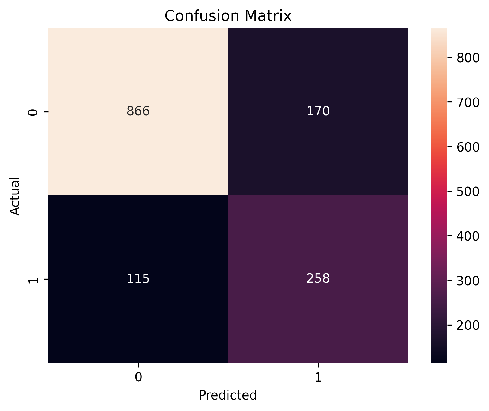

# Telecom Customer Churn Prediction

An end-to-end machine learning project that predicts whether a telecom customer is likely to leave the service, using demographic details, account information, and service usage patterns.

The project covers the full workflow: data cleaning, exploratory analysis, preprocessing, class-imbalance handling with SMOTE, and a Logistic Regression classifier evaluated on a held-out test set.



## Overview

Acquiring a new customer costs far more than retaining an existing one. If a telecom company can identify customers at risk of leaving, it can target them with offers, better support, or contract upgrades before they go.

This project explores that problem using a customer churn dataset of 7,043 customers and 21 features.

The notebook:

- Loads and inspects the dataset
- Converts `TotalCharges` to numeric and imputes missing values with the median
- Performs 10 exploratory analyses of churn against contract, tenure, pricing, payment method, and services
- Drops the `customerID` identifier and one-hot encodes categorical features
- Splits data 80/20 into training and test sets
- Balances the training set using SMOTE
- Standardizes features with `StandardScaler`
- Trains a Logistic Regression classifier
- Evaluates it with accuracy, confusion matrix, and a classification report

> **Note:** This project is a baseline machine learning model built for learning and portfolio purposes and is not a production-ready retention system.

## How It Works

The pipeline follows these steps:

```
Raw Data (churn.csv)
     │
     ▼
Data Cleaning (TotalCharges fix + median imputation)
     │
     ▼
Exploratory Data Analysis
     │
     ▼
Feature Encoding (One-Hot, drop_first=True)
     │
     ▼
Train / Test Split (80 / 20)
     │
     ▼
SMOTE (training set only)
     │
     ▼
Feature Scaling (StandardScaler)
     │
     ▼
Logistic Regression
     │
     ▼
Evaluation (Accuracy, Confusion Matrix, Precision / Recall / F1)
```

### Logistic Regression

The model estimates the probability that a customer churns:

$$P(\text{churn}) = \frac{1}{1 + e^{-(\beta_0 + \beta_1 x_1 + \dots + \beta_n x_n)}}$$

where each $x_i$ is a (scaled) customer feature and each $\beta_i$ is a learned weight. A customer is classified as likely to churn when this probability crosses the decision threshold (default 0.5).

Logistic Regression was chosen as an interpretable baseline: its coefficients show which features push churn probability up or down.

### Handling Class Imbalance

Churners are the minority class, so a model can look accurate by mostly predicting "No Churn". To counter this, **SMOTE** generates synthetic minority-class samples.

SMOTE is applied **only to the training set**, after the train/test split, so no synthetic data leaks into the test set and the evaluation stays honest.

## Key Findings from EDA

| Factor | Observation |
|---|---|
| Contract type | Month-to-month customers churn significantly more than one- or two-year contract customers |
| Tenure | New customers are most likely to leave; long-tenured customers tend to stay |
| Payment method | Electronic check users show higher churn |
| Online Security / Tech Support | Customers without these services churn more |
| Monthly charges | Higher charges are associated with slightly higher churn |
| Total charges | Churners generally have lower total charges, reflecting shorter customer lifespans |
| Gender | Minimal impact on churn |

## Results

Performance on the held-out test set of 1,409 customers (20% of the data):

| Metric | Score |
|---|---|
| Accuracy | 79.8% |
| Precision (Churn) | 0.60 |
| Recall (Churn) | 0.69 |
| F1-Score (Churn) | 0.64 |

### Confusion Matrix

|  | Predicted: Stay | Predicted: Churn |
|---|---|---|
| **Actual: Stay** | 866 | 170 |
| **Actual: Churn** | 115 | 258 |

**What this means:**

- Of the **373 customers who actually churned**, the model caught **258 (recall 0.69)** and missed 115.
- Of the **428 customers it flagged as churners**, 258 truly churned **(precision 0.60)** and 170 were false alarms.
- Of the 1,036 customers who stayed, 866 were correctly identified as staying.

For retention use cases, recall is often the priority, since missing a churner is usually costlier than offering an incentive to a loyal customer.

## Features

- Complete data science workflow in one notebook
- 10 visual EDA analyses with written business takeaways
- Proper missing-value handling for `TotalCharges`
- One-hot encoding of all categorical variables
- SMOTE applied to training data only (no test-set leakage)
- Feature scaling with `StandardScaler` fitted on training data
- Evaluation with confusion matrix heatmap and classification report
- Reproducible results using fixed random seeds

## Tech Stack

| Technology | Purpose |
|---|---|
| Python | Core programming language |
| Pandas | Data loading, cleaning, and manipulation |
| NumPy | Numerical operations |
| Matplotlib / Seaborn | Data visualization |
| scikit-learn | Train/test split, scaling, Logistic Regression, metrics |
| imbalanced-learn | SMOTE oversampling |
| Google Colab / Jupyter | Development environment |

## Project Structure

```
Telecom-Customer-Churn-Prediction/
│
├── Telecom_Customer_Churn_Prediction.ipynb
│   └── Full analysis: EDA, preprocessing, modeling, evaluation
│
├── churn.csv
│   └── Customer churn dataset (7,043 rows x 21 columns)
│
├── confusion_matrix.png
│   └── Confusion matrix of the final model
│
└── README.md
    └── Project documentation
```

## Installation

### 1. Clone the Repository

```bash
git clone https://github.com/ayxsha04/Telecom-Customer-Churn-Prediction.git
cd Telecom-Customer-Churn-Prediction
```

### 2. Install Dependencies

```bash
pip install pandas numpy matplotlib seaborn scikit-learn imbalanced-learn jupyter
```

## Usage

Launch Jupyter and open the notebook:

```bash
jupyter notebook Telecom_Churn_Prediction.ipynb
```

Run all cells from top to bottom. The notebook expects `churn.csv` in the same directory.

**Google Colab:** upload the notebook and `churn.csv` to Colab and run all cells.

## Configuration

Key parameters can be changed directly in the notebook:

```python
test_size = 0.2          # Train/test split ratio
random_state = 42        # Reproducibility
max_iter = 1000          # Logistic Regression solver iterations
```

The decision threshold defaults to 0.5. Lowering it increases recall (catches more churners) at the cost of precision, which may suit retention campaigns where the cost of a missed churner is high.

## Requirements

- Python 3.x
- pandas, numpy, matplotlib, seaborn
- scikit-learn
- imbalanced-learn

## Limitations

This is a baseline implementation with several limitations:

- Only one model (Logistic Regression) is evaluated, with no comparison against tree-based methods.
- Evaluation relies on a single train/test split rather than cross-validation.
- ROC-AUC and precision-recall curves are not yet included, and these are more informative than accuracy on imbalanced data.
- SMOTE's effect is not isolated with a no-SMOTE baseline comparison.
- No hyperparameter tuning was performed.
- The default 0.5 decision threshold is not tuned to any business cost.

## Future Improvements

- Benchmark Random Forest, XGBoost, and Gradient Boosting against the baseline
- Add ROC-AUC and precision-recall curves
- Use stratified k-fold cross-validation
- Perform hyperparameter tuning (GridSearchCV or Optuna)
- Compare performance with and without SMOTE, and with class weights
- Optimize the decision threshold using estimated retention costs
- Add feature importance and SHAP-based explanations
- Package the pipeline with `sklearn.Pipeline` and deploy as a Streamlit app
